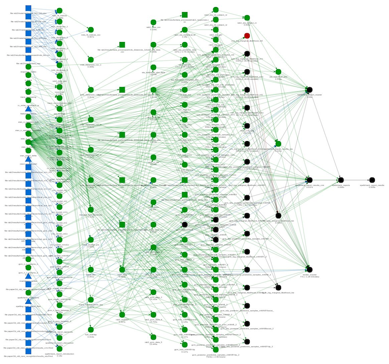
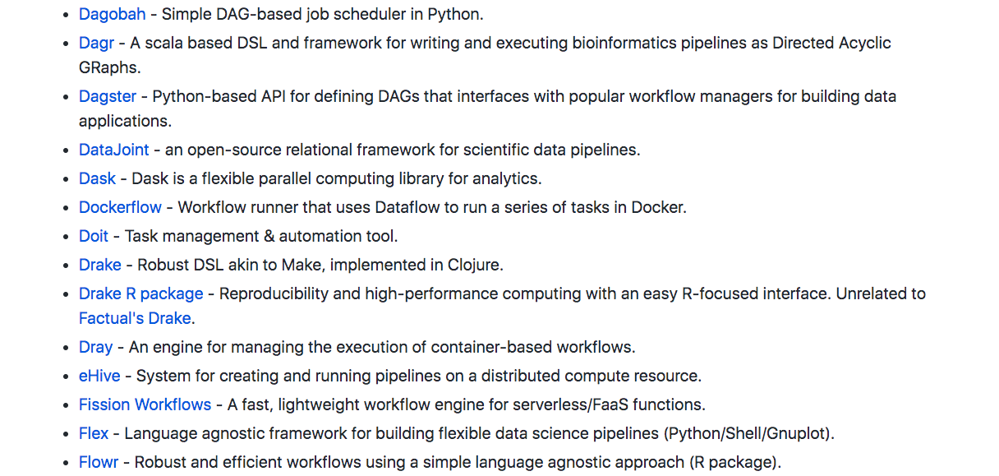

class: center, middle, inverse

```{r x-setup, include=FALSE}
drake::clean()
```


# Reproducible workflows with {drake}

Bioinformatics London Meetup, 2020-01-30

`r icon::fa('twitter')` [mattdray](https://twitter.com/mattdray)
`r icon::fa('github')` [matt-dray](https://github.com/matt-dray)
`r icon::fa('globe')` [rostrum.blog](https://www.rostrum.blog/) 

???
* Entomology MSc and a PhD on ecosystem processes under environmental change
* Over five years in government (Department for Environment, Food and Rural Affairs, Department for Education, Government Digital Service and now the Cabinet Office)
* You can find me in several places
* First things first: I must apologise for two reasons
* You are free to leave if my apology isn't enough

---
class: middle, center


???
* First, I'm sorry if you came here expecting a different Dr Dray

---
class: middle, center


???
* And apologies to all the fans of Canadian 'rapper' Drake

---
class: middle, center


???
* We're talking about something _much more hip_
* {drake}: the R package built by Will Landau for managing workflows and making your analysis pipeline more reproducible
* It's symbols are a brain and a hammer; I think because {drake} stops you from hammering out your own brain

---
class: middle

Do you: 
--

* use R?

--
* use a workflow manager?

--
* use {drake}?

--
* have FOMO about these things?

???
* Let's get to know wach other. 
* Hands-up

---
class: middle, inverse

# Reproducivangelism

---
class: middle

I want to convince you of two things:

1. Make your workflow reproducible
1. {drake} it to make it

---
class: middle, center


From [The Turing Way](https://the-turing-way.netlify.com/introduction/introduction) by The Alan Turing Institute

???
* But first we should define reproducibility
* I think we care about reproducing outputs we've aready created (to prove that we can reliably recreate the outcome) and updating with fresh data (like the next quarter's data)
* But I'm going to refer to 'reproducible' throughout

---
class: middle

Can I recreate what you did:
--

* from scratch?
--

* on a different machine?
--

* in the future?
--

* without you present?

???
* A simpler way of thinking about it might be to answer these questions
* Do I have everything I need: code, data, documentation?
* Maybe I don't have the required packages. Maybe I have a different OS.
* Package dependencies and R versions could break things. Are you protected?
* What if you leave your lab group?
* There are lots of tools for this stuff: RMarkdown, {renv}, Docker

---
class: middle, center


[Reproducible Analytical Pipelines](https://ukgovdatascience.github.io/rap-website/) (RAP)

???
* In government we recognise the benefits of reproducible analysis and publications via packages and R Markdown
* (But mostly we like 'backronyms')
* We want to make sure the whole end-to-end process from data to publication is repeatable.
* Literally this is a badge of pride in government
* Focus is on code and documentation, writing packages and functions, and using RMarkdown

---
class: middle

Can I trust your outputs?

---
class: middle, inverse

# Two things

???
* I want to convince you of two things
* I think there are people in the room who know all this
* I think there are people in the room who don't know what they're missing

---
class: middle

1. Use a workflow manager

2. Use {drake} to do it

---
class: heading-slide, middle, inverse

# 1. Use a workflow manager

???
* You have interdependencies of some form
* Multiple files and functions
* Read, wrangle, model, plot, report
* Stuff in, stuff happens, stuff out

---
class: middle

But why?

???
* Interdependencies become too complex
* You can't record them easily

---
class: middle, center



???
* Tweet via [Frederick Aust](https://twitter.com/FrederikAust/status/1205103780938833921?ref_src=twsrc%5Etfw)

---
class: middle

What if something changes?

???
* What impact does a change to file 'A' have?
* Do you re-run everything from scratch?
* What if it's time intensive?

---
class: middle

You need a workflow manager


---
class: middle, center



[pditommaso/awesome-pipeline](https://github.com/pditommaso/awesome-pipeline)

???
* There are many workflow managers -- some general, some language-specific
* The one that most people might be familiar with is Make (capital 'M')
* So if there's so many then why {drake}?

---
class: heading-slide, middle, inverse

# Why {drake}?

---
class: middle

Why is {drake} compelling?

* R-specific
* free
* great docs
* meets [rOpenSci](https://ropensci.org/)'s rigour
* peer-reviewed
* under active development
* Will Landau himself


---
class: middle

{drake} is straightforward

1. `drake_plan()`
1. `make()`
1. Change stuff
1. Go to 2

???
* The smallest amount of things you need to do is run two functions
* You create a 'plan' object that' contains the functions, objects and data in your's a bit like a recipe for generating your analysis
* Then you run `make()` on that object to run the steps and 'bake your cake'
* Let's go through a simple, arbitrary, trivial example
* We're not going to think too hard about folder structure in this example
* In fact, this workflow will be running from within this {xaringan} (RMarkdown slides)

---
class: middle, inverse

# Simple demo

---
class: middle

```{r x-lib, messages=FALSE}
library(drake)
library(dplyr)
library(ggplot2)
library(rphylopic)
```

???
* The first couple of steps look like a 'normal' analysis
* First we load the packages we want to use
* {rphylopic} taps into the Phylopic API so we can grab a royalty-free image to adorn our plot

---
class: middle

```{r x-fun}
b_plot <- function(data, image) {
  ggplot(data, aes(id, temp)) +
    geom_boxplot() +
    labs(title = "Weasel temperature") +
    add_phylopic(image)
}

b_table <- function(data) {
  beavers_trim <- data %>% 
    group_by(id) %>% 
    summarise(
      mean = mean(temp), sd = sd(temp),
      min = min(temp, max = max(temp))
      ) %>% ungroup()
  return(beavers_trim)
}
```

???
* And then perhaps we've developed a couple of functions
* Here we have one that plots to particular specifications
* And one that produces a very simple table of descriptive statistics
* The beady-eyed among you may have spotted an error in my functions; keep that in mind

---
class: middle

```{r x-drake-plan}
plan <- drake_plan(
  # wrangle data
  b1 = mutate(beaver1, id = "A"),
  b2 = mutate(beaver2, id = "B"),
  beavers = bind_rows(b1, b2),
  # phylopic image
  uid = "be8670c2-a5bd-4b44-88e8-92f8b0c7f4c6",
  png = image_data(uid, size = "512")[[1]],
  # outputs
  plot = b_plot(beavers, png),
  table = b_table(beavers),
  report = rmarkdown::render(
    knitr_in("beavers-report.Rmd"), quiet = TRUE, #<<
    output_file = file_out("beavers-report.html") #<<
  )
)
```

???
* Now we bring in `drake_plan()`
* We wrap the steps of the analysis in this function -- wrangling, fetching a phylopic image, building the outputs (a plot, table and RMarkdown report)
* This doesn't look too dissimilar to a regular script file
* Maybe your analyses are similar in terms of reading in data, wrangling it and outputting it in some way
* Particularly if that last step is a thesis or paper

---
class: middle

```{r x-plan}
plan
```

???
* What does the plan object look like?
* It's a data frame
* Two columns: one for 'targets' and one for 'commands'
* Targets are the things being acted upon and commands are the tasks
* This plan is the key to how {drake} 'remembers' your workflow: it knows the relationships between all the steps and the order they're in
* So far we haven't built anything, we've just created the receipe

---
class: middle

```{r x-make-notrun, echo=FALSE, message=FALSE}
drake::make(plan)
```
```{r x-make-run,eval=FALSE}
drake::make(plan)
```
```
## target uid
## target b1
## target b2
## target png
## target beavers
## target table
## target plot
## target report
```

???
* To run the workflow, you use `make()`

---
class: middle, center

```{r x-out-weasel, echo=FALSE}
include_url(
  "https://matt-dray.github.io/drake-bioinformatics/weasel-report.html",
  height = 500
)
```

???
* Here's what the rendered output looks like
* The data was wrangled, a plot and table were produced and this was recorded in an R Markdown file
* This was rendered to HTML


---
class: middle

```{r x-config}
config <- drake_config(plan)
config$graph
```

---
class: middle

```{r x-graph-notrun, eval=FALSE}
vis_drake_graph(
  config,
  main = "", width = 800, height = 600,
  navigationButtons = FALSE, font_size = 15
)
```

???
* {drake} has a function that takes advantage of {visNetwork} to display the dependency graph
* You pass it the `config` object
* Other arguments here are aesthetic

---
class: middle

```{r x-graph-run, echo=FALSE}
vis_drake_graph(
  config, main = "", width = 800, height = 600,
  navigationButtons = FALSE, font_size = 15
)
```

???
* Targets have different shapes: triangles are functions
* The arrows show the dependencies: a target with two arrows going in means that it has two dependencies
* You can trace thes dependencies from one end to the other

---
class: middle

```{r x-cached}
cached()
```

These are in a hidden `.drake/` folder

???
* You might be wondering where the targets 'live'
* They get cached -- stored in a folder
* That folder is hidden in the project directory as `.drake/`

---
class: middle

```{r x-readd}
readd(table)
```

???
* How can you access objects in the cache?
* `readd()` and `loadd()` do this
* In fact, this is how the R Markdown file in this example fetches the plot and table

---
class: middle

```{r x-plot-fix}
b_plot <- function(data, image) {
  ggplot(data, aes(id, temp)) +
    geom_boxplot() +
    labs(title = "Beaver temperature") + #<<
    add_phylopic(image)
}

outdated(config)
```

???
* Remember I said there was a problem with one of my functions?
* Yes, the plot function used the word 'weasel' instead of 'beaver' in the title
* Let's go back and update the function
* This update means that the targets that depend on this function need to be updated
* These can be checked with a call to `outdated()`

---
class: middle

```{r x-graph-outdated-notrun, eval=FALSE}
vis_drake_graph(
  config, main = "", width = 800, height = 600,
  navigationButtons = FALSE, font_size = 15
)
```

???
* We can revisit the network graph to get a visual representation of the impact of our change

---
class: middle

```{r x-graph-outdated, echo=FALSE}
vis_drake_graph(
  config, main = "", width = 800, height = 600,
  navigationButtons = FALSE, font_size = 15
)
```

???
* You can now see that the colour of some targets has turned black
* These are the targets that are now out of date
* {drake} remembered this to you didn't have to

---
class: middle

```{r x-plan-outdated-notrun, echo=FALSE, message=FALSE}
drake::make(plan)
```
```{r x-plan-outdated, eval=FALSE}
drake::make(plan)
```
```
## target plot
## target report
```

???
* Of course, we can now re-`make()` the plan
* {drake} will only update the things that have been impacted by our change
* This is a trivial example -- consider how helpful this would be if you had even more targets and more complicated relationships, especially if you have steps that are computationally-intensive

---
class: middle, center

```{r x-out, echo=FALSE}
include_url(
  "https://matt-dray.github.io/drake-bioinformatics/beavers-report.html",
  height = 500
)
```

???
* And we can peak at the rendered R Markdown once more to check that our change to the plot function had its desired effect

---
class: middle

1. `drake_plan()`
1. `make()`
1. Change stuff
1. Go to 2

???
* Let's recap those steps again
* Create a plan with targets and commands -- it's a dataframe
* Make that plan to run the analysis
* Something changes -- input data, function specifications, etc
* (You can check what's outdated and check the network graph)
* Now re-`make()`
* And you can do this over and over

---
class: inverse, middle

# What now?

---
class: middle

What wasn't covered:

* high-performance computing
* parallelism
* dynamic branching
* other cool stuff

???
* Clearly there isn't enough time to go through all the great things about {drake}
* Just try it
* Luckily {drake} has rich documentation

---
class: middle

Official {drake} docs:

* rOpenSci [site](https://docs.ropensci.org/drake/)
* the [user manual](https://books.ropensci.org/drake/)
* an [rOpenSci community call](https://ropensci.org/commcalls/2019-09-24/)
* [learndrake](https://github.com/wlandau/learndrake) in the cloud
* [drakeplanner](https://wlandau.shinyapps.io/drakeplanner/_w_7935044f/) Shiny app
* launch [drake examples](https://github.com/wlandau/drake-examples) in the cloud

---
class: middle

Try it

---
class: inverse, middle

# Reproducible workflows with {drake}

* Make your workflow reproducible
* {drake} it to make it

`r icon::fa('twitter')` [mattdray](https://twitter.com/mattdray)
`r icon::fa('github')` [matt-dray](https://github.com/matt-dray)
`r icon::fa('globe')` [rostrum.blog](https://www.rostrum.blog/) 

---
class: middle

Sources

* [Dre and snoop](https://commons.wikimedia.org/wiki/File:Snoop_Dogg_and_Dr._Dre.jpg)
* [Drake]()
* [Sir Francis](https://commons.wikimedia.org/wiki/File:Francis_Drake,_por_un_artista_an%C3%B3nimo.jpg)
* [Drake Bell](https://commons.wikimedia.org/wiki/File:Drake_Bell_2019_by_Glenn_Francis.jpg)
* [Duck](https://commons.wikimedia.org/wiki/File:Drake1-1.jpg)
* [{drake} hex sticker]()
* [RAP hex sticker]()
* {drake} plan from [a tweet by Frederik Aust]()