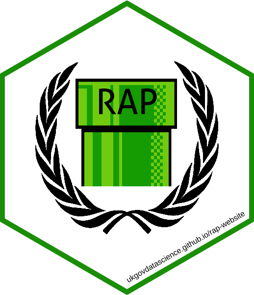

class: center, middle, inverse

```{r x-setup, include=FALSE}
drake::clean()
```


# Reproducible workflows with {drake}

Bioinformatics London Meetup, 2020-01-30

`r icon::fa('twitter')` [mattdray](https://twitter.com/mattdray)
`r icon::fa('github')` [matt-dray](https://github.com/matt-dray)
`r icon::fa('globe')` [rostrum.blog](https://www.rostrum.blog/) 

???
* Thank you for being here instead of at rstudioconf
* Entomology MSc and a PhD on ecosystem processes under environmental change
* Over five years in government (Department for Environment, Food and Rural Affairs, Department for Education, Government Digital Service and now the Cabinet Office)
* You can find me in several places
* First things first: I must apologise for two reasons
* You are free to leave if my apology isn't enough

---
class: middle, center


???
* First, I'm sorry if you came here expecting a different Dr Dray

---
class: middle, center


???
* And apologies to all the fans of Canadian 'rapper' Drake

---
class: middle, center


[{drake}](https://docs.ropensci.org/drake/) by [Will Landau](https://wlandau.github.io/)

???
* We're talking about something _much more hip_
* {drake}: the R package built by Will Landau for managing workflows and making your analysis pipeline more reproducible
* It's symbols are a brain and a hammer; I think because {drake} stops you from hammering out your own brain

---
class: middle

`r emo::ji("raising_hand")` Do you: 
--

* use R?
--

* use a workflow manager?
--

* use {drake}?
--

* have FOMO?

---
class: middle, inverse

# Reproducevangelism

???
* I don't want to condescend, I want to build from simple principles
* So let's define 'reproducibility'
* Very important in the scientific fields given the reproducibility crisis

---
class: middle, center


From [The Turing Way](https://the-turing-way.netlify.com/introduction/introduction) by The Alan Turing Institute

???

* The book is a great resource for reproduciblity in general
* I think we care about both (i) recreating ouputs and (ii) updating with fresh data
* But I'm going to refer to 'reproducible' throughout

---
class: middle

Can I recreate what you did:
--

* from scratch?
--

* on a different machine?
--

* in the future?
--

* without you present?

???
* We can simplify this as questions to ask yourself
* Do I have everything I need: code, data, documentation?
* Maybe I don't have the required packages. Maybe I have a different OS.
* Package dependencies and R versions could break things. Are you protected?
* What if you leave your lab group?

---
class: middle, center

[Reproducible Analytical Pipelines](https://ukgovdatascience.github.io/rap-website/) (RAP)



[Can {drake} RAP?](https://www.rostrum.blog/2019/07/23/can-drake-rap/)

???
* In government we recognise the benefits of reproducible analysis and publications via packages and R Markdown
* We want to make sure the whole end-to-end process from data to publication is repeatable
* Literally this is a badge of pride in government
* I wrote a thing about how {drake} might be useful for RAP in government

---
class: middle

Can I trust the outputs?

--

Can _you_ trust the outputs?

???
* To be blunt, can I trust your workflow?
* And, possibly more importantly, can you?

---
class: middle

Let me tell about two things:

1. Make _workflows_ reproducible
1. Use {drake} to do it

???
* So in this context of reproducibility, let's talk about improving reproducibility with an approach you may not be thinking about, or that you want to simplify

---
class: heading-slide, middle, inverse

# 1. Reproworkflows

???
* You have multiple files and functions that interact
* Read, wrangle, model, plot, report
* Stuff in, stuff happens, stuff out

---
class: middle

R has [many analytical reproducibility tools](https://annakrystalli.me/talks/r-in-repro-research-dc.html#1), like:

* [RStudio Projects](https://swcarpentry.github.io/r-novice-gapminder/02-project-intro/)
* [Packages](https://www.hvitfeldt.me/blog/usethis-workflow-for-package-development/) for reusable code
* [R Markdown](https://rmarkdown.rstudio.com/) for reproducible docs
* [{here}](https://github.com/jennybc/here_here) for relative filepaths
* [{renv}](https://rstudio.github.io/renv/articles/renv.html) for dependency management

???
* R has solutions for making your code work on other's machines now and in the future
* They also speed up and can help automate your work
* You can use Git with these to ensure version control too

---
class: middle

What about your analytical _workflow_ itself?

???
* Have you considered this before?

---
class: middle

What if:
--

* you can't remember all the steps?
--

* interdependencies become complex?
--

* some of your code takes ages to run?
--

* something changes?

???
* What impact does a change to file 'A' have?
* What if it's time intensive?
* Do you re-run everything from scratch?

---
class: middle, center


You can't remember this

???
* Tweet via [Frederick Aust](https://twitter.com/FrederikAust/status/1205103780938833921?ref_src=twsrc%5Etfw)
* But it can get messy quickly
* You might have hundreds of files, functions and objects

---
class: middle

Strategies to improve upon:

* unsaved, undocumented `untitled.R*`
* `01-read.R`, `02-wrangle.Rmd`, etc
* step-by-step in a `README.md`

???
* You still don't know how individual objects and functions interact
* You will still have to run from scratch in most cases
* Maybe think less about grouping code like this and more about managing interactions between individual targets

---

class: middle, center

Let a workflow manager handle it


`r icon::fa('github')` [pditommaso/awesome-pipeline](https://github.com/pditommaso/awesome-pipeline)

???
* There are many workflow managers -- some general, some language-specific
* The one that most people might be familiar with is Make (capital 'M')

---
class: heading-slide, middle, inverse

# 2. {drake} it to make it

???
* So if there's so many managers then why {drake}?

---
class: middle, center


'What gets done stays done'

---
class: middle

{drake} is compelling because it's:
--

* R-specific
--

* got great docs and examples
--

* part of [rOpenSci](https://ropensci.org/)
--
 
* under active development
--

* free!

???
* rOpenSci is 'carefully vetted, staff- and community-contributed R software tools that lower barriers to working with scientific data sources and data that support research applications on the web'

---
class: middle

At its simplest:

1. `drake_plan()`
1. `make()`
1. Change stuff
1. Go to 2

???
* The smallest amount of things you need to do is run two functions
* You create a 'plan' object that' contains the functions, objects and data in your's a bit like a recipe for generating your analysis
* Then you run `make()` on that object to run the steps and 'bake your cake'
* Let's go through a simple, arbitrary, trivial example
* We're not going to think too hard about folder structure in this example
* In fact, this workflow will be running from within this {xaringan} (RMarkdown slides)

---
class: middle, inverse

# Small demo


---
class: middle

```{r x-lib, messages=FALSE}
# All available from CRAN
# Use install.packages()
library(drake)
library(dplyr)
library(ggplot2)
library(rphylopic)
```

???
* The first couple of steps look like a 'normal' analysis
* First we load the packages we want to use
* {rphylopic} taps into the Phylopic API so we can grab a royalty-free image to adorn our plot

---
class: middle

```{r x-fun}
b_plot <- function(data, image) {
  ggplot(data, aes(id, temp)) +
    geom_boxplot() +
    labs(title = "Weasel temperature") +
    add_phylopic(image)
}

b_table <- function(data) {
    group_by(data, id) %>% 
    summarise(
      mean = mean(temp), sd = sd(temp),
      min = min(temp), max = max(temp)
    ) %>%
    ungroup()
}
```

???
* And then perhaps we've developed a couple of functions
* Here we have one that plots to particular specifications
* And one that produces a very simple table of descriptive statistics
* The beady-eyed among you may have spotted an error in my functions; keep that in mind

---
class: middle

```{r x-drake-plan}
plan <- drake_plan(
  # Wrangle data
  b1 = mutate(beaver1, id = "A"),
  b2 = mutate(beaver2, id = "B"),
  beavers = bind_rows(b1, b2),
  # Phylopic image
  uid = "be8670c2-a5bd-4b44-88e8-92f8b0c7f4c6",
  png = image_data(uid, size = "512")[[1]],
  # Outputs
  plot = b_plot(beavers, png),
  table = b_table(beavers),
  report = rmarkdown::render(
    knitr_in("beavers-report.Rmd"), quiet = TRUE, #<<
    output_file = file_out("beavers-report.html"), #<<
  )
)
```

???
* Now we bring in `drake_plan()`
* We wrap the steps of the analysis in this function -- wrangling, fetching a phylopic image, building the outputs (a plot, table and RMarkdown report)
* This doesn't look too dissimilar to a regular script file
* Maybe your analyses are similar in terms of reading in data, wrangling it and outputting it in some way
* Particularly if that last step is a thesis or paper

---
class: middle

```{r x-plan}
plan  # it's a dataframe
```

???
* What does the plan object look like?
* It's a data frame
* Two columns: one for 'targets' and one for 'commands'
* Targets are the things being acted upon and commands are the tasks
* This plan is the key to how {drake} 'remembers' your workflow: it knows the relationships between all the steps and the order they're in
* So far we haven't built anything, we've just created the receipe

---
class: middle

```{r x-make, message=FALSE}
drake::make(plan)  # build the targets
```
```
## target uid
## target b1
## target b2
## target png
## target beavers
## target plot
## target table
## target report
```

???
* To run the workflow, you use `make()`

---
class: middle, center

```{r x-out-weasel, echo=FALSE}
include_url(
  "https://matt-dray.github.io/drake-bioinformatics/weasel-report.html",
  height = 500
)
```

???
* Here's what the rendered output looks like
* The data was wrangled, a plot and table were produced and this was recorded in an R Markdown file
* This was rendered to HTML


---
class: middle

```{r x-config}
config <- drake_config(plan)  # a list
config$graph  # e.g. an igraph object
```

---
class: middle,

```{r x-graph}
vis_drake_graph(config, main = "", width = 800, height = 450,
                navigationButtons = FALSE, font_size = 15)
```

???
* {drake} has a function that takes advantage of {visNetwork} to display the dependency graph
* You pass it the `config` object
* Other arguments here are aesthetic
* Targets: circle is object, square is fie, triangle is function
* The arrows trace the dependencies

---
class: middle

```{r x-cached}
cached()  # targets in hidden .drake/ folder
```

???
* You might be wondering where the targets 'live'
* They get cached -- stored in a folder
* That folder is hidden in the project directory as `.drake/`

---
class: middle

```{r x-readd}
readd(table)  # read from the cache
```

???
* How can you access objects in the cache?
* `readd()` and `loadd()` do this
* In fact, this is how the R Markdown file in this example fetches the plot and table

---
class: middle

```{r x-plot-fix}
b_plot <- function(data, image) {
  ggplot(data, aes(id, temp)) +
    geom_boxplot() +
    labs(title = "Beaver temperature") +  # fix! #<<
    add_phylopic(image)
}
```
```{r x-outdated}
outdated(config)  # check what's impacted
```

???
* Remember I said there was a problem with one of my functions?
* Yes, the plot function used the word 'weasel' instead of 'beaver' in the title
* Let's go back and update the function
* This update means that the targets that depend on this function need to be updated
* These can be checked with a call to `outdated()`

---
class: middle

```{r x-graph-outdated}
vis_drake_graph(config, main = "", width = 800, height = 450,
                navigationButtons = FALSE, font_size = 15)
```

???
* We can revisit the network graph to get a visual representation of the impact of our change
* You can now see that the colour of some targets has turned black
* These are the targets that are now out of date
* {drake} remembered this to you didn't have to

---
class: middle

```{r x-plan-outdated, message=FALSE}
drake::make(plan)  # rebuild outdated targets
```
```
## target plot
## target report
```


???
* Of course, we can now re-`make()` the plan
* {drake} will only update the things that have been impacted by our change
* This is a trivial example -- consider how helpful this would be if you had even more targets and more complicated relationships, especially if you have steps that are computationally-intensive

---
class: middle

```{r x-out, echo=FALSE}
include_url(
  "https://matt-dray.github.io/drake-bioinformatics/beavers-report.html",
  height = 500
)
```

???
* And we can peak at the rendered R Markdown once more to check that our change to the plot function had its desired effect

---
class: middle

To recap:
--

1. `drake_plan()`
--

1. `make()`
--

1. Change stuff
--

1. Go to 2

???
* Let's recap those steps again
* Create a plan with targets and commands -- it's a dataframe
* Make that plan to run the analysis
* Something changes -- input data, function specifications, etc
* (You can check what's outdated and check the network graph)
* Now re-`make()`
* And you can do this over and over
* What gets done stays done

---
class: inverse, middle

# What now?

---
class: middle

Try it

---
class: middle

Check out official {drake} materials:

* rOpenSci [site](https://docs.ropensci.org/drake/)
* the [user manual](https://books.ropensci.org/drake/)
* an [rOpenSci community call](https://ropensci.org/commcalls/2019-09-24/)
* [learndrake](https://github.com/wlandau/learndrake) in the cloud
* [drakeplanner](https://wlandau.shinyapps.io/drakeplanner/_w_7935044f/) Shiny app
* launch [drake examples](https://github.com/wlandau/drake-examples) in the cloud
* source [on GitHub](https://github.com/ropensci/drake)
* the [CRAN listing](https://cloud.r-project.org/web/packages/drake/index.html)

---
class: middle

We didn't cover everything, like:

* target-creation history and recovery
* high-performance computing
* static and dynamic branching
* time prediction
* memory strategies
* trigger customisation

???
* Clearly there isn't enough time to go through all the great things about {drake}
* Luckily {drake} has rich documentation

---
class: middle

Revisit today's materials with:

* the [slides](https://matt-dray.github.io/drake-bioinformatics/#1) in your browser
* the [source](https://github.com/matt-dray/drake-bioinformatics) for the slides
* an [.R script file](https://github.com/matt-dray/drake-bioinformatics/blob/master/drake-beavers-workflow.R) of all the {drake} code 

---
class: inverse, middle

# Reproducible workflows with {drake}

1. Make workflows reproducible
1. Use {drake} to do it

What gets done stays done!

`r icon::fa('twitter')` [mattdray](https://twitter.com/mattdray)
`r icon::fa('github')` [matt-dray](https://github.com/matt-dray)
`r icon::fa('globe')` [rostrum.blog](https://www.rostrum.blog/) 

---
class: middle

Sources

* Dr Not-Dray [via Wikimedia Commons](https://commons.wikimedia.org/wiki/File:Snoop_Dogg_and_Dr._Dre.jpg)
* Canadian rapper [via Wikimedia Commons](https://commons.wikimedia.org/wiki/Category:Drake)
* {drake} [hex logo](https://camo.githubusercontent.com/44749362ca36c9e3295f2bcf18975d811564c121/68747470733a2f2f646f63732e726f70656e7363692e6f72672f6472616b652f7265666572656e63652f666967757265732f6c6f676f2e737667)
* {drake} hairball by [Frederik Aust](https://twitter.com/FrederikAust/status/1205103780938833921?s=20)
* _Castor canadensis_ from [PhyloPic](http://phylopic.org/image/b3dd721e-6084-4413-8300-44e10d8fd3ca/)